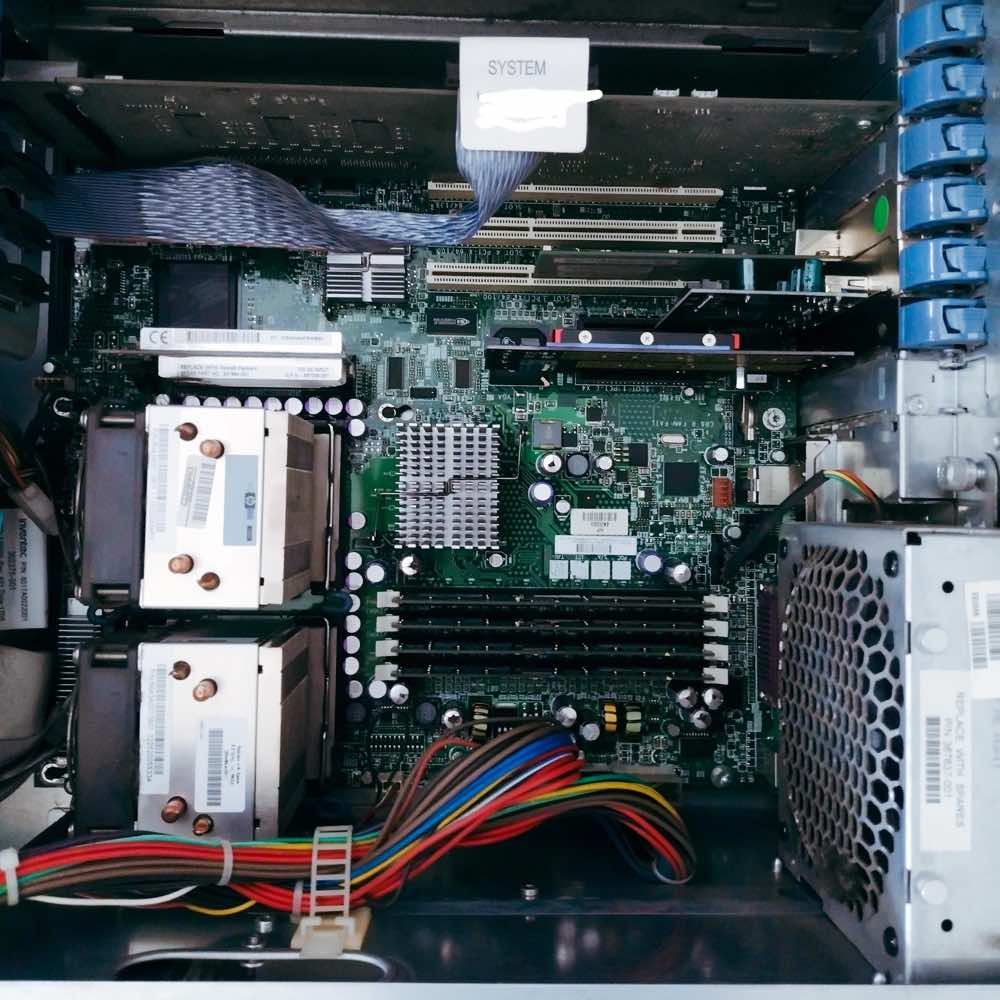

## 1. ROUTERS
#netdevices
Typicky je ROUTER zariadenie prideľujúce IP adresy a preto je na 3 sieťovej vrstve

Pokiaľ riešime malú sieť SOHO (SMALL OFFICE \ HOME OFFICE) približne do 10 zariadení tak si vystačíme s obyčajným routrom s WiFi alebo bez. 

Typicky takýto router obsahuje:
1. 4x RJ45 porty LAN
2. 1x RJ45 port WAN
3. DHCP server
4. DNS server pre LAN
5. Wifi s rôznymi bezpečnostnými protokolmi WEP, WPA1 až WPA3, WPS a pod.
6. Firewall rôznej kvality.
7. Autonómna sieť pre Hostí GUEST NETWORK
8. DMZ Demilitarizovaná zóna

Pri výbere zohľadňujeme okrem rýchlosti, množstva ENDPOINTOV a premávky Trafficu aj softvérový základ. 
OpenWRT je routerová verzia odľahčeného Linuxu a je OPEN SOURCE.
Kvalita a frekvencia UPDATOV A PATCHOV

Pre **elimináciu "Single Point of Failure" (SPoF)** v sieti je potrebné navrhnúť **redundantnú a odolnú infraštruktúru**, ktorá zabezpečí **kontinuitu prevádzky** aj v prípade zlyhania jedného zložky.

## 2. SWITCHES AND HUBS

**2.1  ACCESS LAYER**

HUB je LEGACY zariadenie = SEN KAŽDÉHO HACKERA
Typicky je SWITCH zariadenie rozdeľujúce PACKETY na Layer 2 

**2.2 DISTRIBUTION LAYER** 

MULTI LAYER SWITCH a Layer 3 Switche
Su manazovatelne switche s webovym rozhranim a ssh, ktore mozno nakonfigurovat na zrkadlenie portov, pokrocile smerovanie a pod. Su ovela drahsie a vykonnejsie ako klasicke switche.

**2.3 CORE LAYER**

SUPER SWITCHE Tbps trafficu

## 3. DYNAMIC FIREWALLS

V Session2 sme nastavovali softvérový firewall v počítači. Okrem tohto Firewallu aj Router väčšinou obsahuje nejakú formu Firewallu rôznej kvality. Pre serióznu ochranu siete však budeme potrebovať špecializovaný sieťový komponent, ktorý zvládne odfiltrovať veľkú časť škodlivého kódu a pozná množstvo hrozieb z internetu. 

Množstvo výrobcov vyrába takéto SECURITY zariadenia pod rôznymi názvami ZyWall, SonicWall, Turris, pfSense, Fortinet, Juniper ... Tieto firewally okrem schopnosti kontrolovať aj obrovské množstvo sieťovej prevádzky majú jednu spoločnú vlastnosť.

Dynamicky menia RULES podľa najnovších známych hrozieb a za týmto procesom je práca množstva ITSEC špecialistov. Väčšina korporátnych Firewallov preto vyžaduje ročný poplatok za tento servis. Zaplatiť ho je podmienkou vysokej ochrany, ktorú zariadenie sieti poskytuje. 

V našich zemepisných šírkach máme k dispozícií Firewall vyvíjaný ako OPEN SOURCE v ČR firmou TURRIS. Jej Firewally sa vyznačujú prijateľnou cenou  a bez ročných poplatkov. Firewall sa upgraduje niekoľkokrát za deň a poskytuje množstvo užitočných informácií pre IT SEC. 

 

Turris Omnia
Zywall
SonicWall
pfSense
 
 ## 4. VPN (VIRTUAL PRIVATE NETWORK)
#vpn
Najpoužívanejším softvérovým riešením pripojenia cez VPN do a z našej lokálnej siete je OpenVPN. Budeme potrebovať. Ide o vytvorenie tunela IPSEC do lvzdialenej LAN.

4.1 ABY NAS INTERNET POZNAL >

DDNS - Dynamicka DNS
alebo verejna staticka IP

4.2 SPOJIT VPNserver s externymi klientami

1. Vygenerovať certifikáty a kryptografické kľúče.
2. Aktivovať OpenVPN server na našom routri.
3. Nahrať kľúče a nastavenie na cieľový počítač.
4. Stiahnuť a aktivovať OpenVPN klienta na ENDPOINTE z ktorého sa chceme prihlasovať do počítača. 

OpenVPN nám poskytne šifrované pripojenie do našej LAN s možnosťou využívania pripájania sa na lokálne servery a služby. 

POZOR OpenVPN aj napriek tomu, že rieši bezpečnosť prenosu nesie so sebou množstvo iných bezpečnostných problémov. Napríklad možnosť zneužitia prístupu z ENDPOINTU, ktorý nemáme plne pod kontrolou. 

[[FORTIGATE NASTAVENIE VPN]]

##### **4.3 BEZPECNA ALTERNATIVA K VPN

ZERO CONFIG VPN - TAILSCALE, ZEROTIER

INE RIESENIA: CLOUDFLARE TUNNEL, ZyXEL NEBULA

ZERO TRUST RIESENIE - TWINGATE

> [!warning] 
> POZOR - NESPRAVNA KONFIGURACIA SERVERA ALEBO NEDOSTATOCNA OCHRANA KLIENTA MOZE OHROZIT CELU LAN.
> 
>ZERO TRUST NETWORKS - NEDOVERUJ NIKOMU

#### **4.4 NAJČASTEJŠIE ZRANITEĽNOSTI VPN PRIPOJENIA PRI NESPRÁVNOM NAKONFIGUROVANÍ :

* DNS uniky dns zaznamov
* WebRTC uniky IP adries
* IPv6 uniky IP adries
* VPN protokol zranitelnosti

* NSA ExtraBacon Exploit cez SNMP protocol

>[! info] 
>Vzdy zvazuj CLOUDOVE RIESENIE, ktore znizuje naklady na zelezo, bezpecnost a zalohovanie.

## 5. KVM SWITCH
#kvm
Keyboard Video Mouse - zariadenie pre ovládanie väčšieho počtu Headless Serverov cez jednu klávesnicu, myš a displej.

KVM over Ethernet

## 6. SERVER ANATOMIA

Každý počítač sa môže stať serverom no nie každý počítač je stavaný ako server.

Server je špeciálny počítač poksytujúci svoje služby klientom 24 \ 7 za každých okolností a počasia. Od klasického PC sa líši

2x a viac 1Gbps RJ45 NIC
Vysoký výpočntový výkon procesora Intel Xeon, AMD Opteron, AMD Epyc a pod
Viac pamäťových slotov RAM
RAID radič pre viacero supervýkonných diskov
HOTSWAP vyberanie diskov za chodu servera
Redundantné napájanie viacero zdrojov
IPMI, iDRAC, ILO systém na diaľkový manažment a monitorovanie prevádzky.

 

>[! warning] 
>!!!POZOR FYZICKA BEZPECNOST, server treba fyzicky skontrolovat a poznat jeho presny obsah, zapecatit skrinku proti neopravnenemu vniknutiu !!!

>[!info] PREVADZKA SERVERA STOJI NEMALE PENIAZE - VZDY BY STE JEHO NAKUP A OPODSTATNENIE MALI ZVAZIT

### **7. WIFI Wireless 802.11x
#wifi
#### 7.1 FREKVENCIE A POCET KANALOV
2.4GHz a 5 GHz

#### 7.2 RYCHLOSTI:
* 802.11b - 11Mbps
* 802.11g - 54Mbps
* 802.11n az 600Mgps {5GHz pasmo}
* 802.11ac - WIFI5 az 3.46Gbps
* 802.11ax - WIFI 6 az 9.6Gbps cez cviacero kanalov
* 802.11be WIFI7 az teoretickych 46Gbps

#### 7.3 PRVA VYSTRAHA - IDENTITA
Vsetky MAC Adresy vo vzduchu

>[!info] SIGINT - SIGNAL INTELIGENCE - Zachytávanie rôznych signálov a získavanie spravodajských informácií z nich.

#### 7.4 DRUHA VYSTRAHA - VERBOZITA
Nepoznate moju siet ? Som doma? Som v hoteli ?

#### 7.5 TRETIA VYSTRAHA -RYCHLY ALGORITMUS - SLABE SIFROVANIE
Problém s kryptografiou

| Štandard šifrovania                | Popis                                                                          | Bežné zraniteľnosti                                                                                                             | Úroveň bezpečnosti (2025)                   |
| ---------------------------------- | ------------------------------------------------------------------------------ | ------------------------------------------------------------------------------------------------------------------------------- | ------------------------------------------- |
| **Otvorená (bez šifrovania)**      | Žiadna autentifikácia ani šifrovanie; ktokoľvek sa môže pripojiť.              | Odpočúvanie, útok typu "Man-in-the-Middle" (MITM), krádež údajov, neoprávnený prístup.                                          | ❌ Extrémne nezabezpečené                    |
| **WEP (Wired Equivalent Privacy)** | Starý štandard (1997); používa šifrovanie RC4 s kľúčmi 40/104-bitovými.        | Ľahko prelomený za minúty pomocou nástrojov ako Aircrack-ng (útoky na kolízie IV, chopchop, fragmentácia).                      | ❌ Extrémne nezabezpečené                    |
| **WPA (Wi-Fi Protected Access)**   | Predstavený v roku 1999 ako náhrada za WEP; používa šifrovanie TKIP.           | Zraniteľný voči útokom na TKIP (napr. chopchop, Michaelov útok), prelomeniu PSK (slovníkové útoky) a chybám WPS.                | ❌ Nezabezpečené                             |
| **WPS (Wi-Fi Protected Setup)**    | Zjednodušený spôsob pripojenia (PIN alebo tlačidlo).                           | Útoky hrubou silou na PIN (Reaver/Wash), útoky typu MITM na tlačidlo, zraniteľnosti zamrznutia routera.                         | ❌ Nezabezpečené                             |
| **WPA2-Personal (AES-CCMP)**       | Najbežnejší štandard (2004); používa šifrovanie AES s PSK (Predzdieľaný kľúč). | Zraniteľný voči offline slovníkovým útokom (ak je heslo slabé), útoku KRACK (Key Reinstallation Attack) a útokom na PMKID.      | ✅ Bezpečné (ak je heslo silné)              |
| **WPA2-Enterprise (802.1X)**       | Používa RADIUS server na autentifikáciu; podporuje metódy EAP (PEAP, EAP-TLS). | Zraniteľný voči nesprávne nastaveným RADIUS serverom, slabým EAP metódam (napr. EAP-MD5) a útokom falošných prístupových bodov. | ✅✅ Veľmi bezpečné (ak je správne nastavené) |
| **WPA3-Personal**                  | Novší štandard (2018); používa SAE (Simultaneous Authentication of Equals).    | Zraniteľný voči útokom Dragonblood (downgrade útoky, úniky cez bočné kanály), ale oveľa ťažšie prelomiteľný ako WPA2.           | ✅✅ Bezpečné                                 |
| **WPA3-Enterprise**                | Podnikové zabezpečenie s 192-bitovým šifrovaním a EAP-TLS.                     | Rané implementácie mali zraniteľnosti (napr. Dragonblood), ale moderné firmvéry ich už opravili.                                | ✅✅✅ Najbezpečnejšie                         |
#### 7.6 POSLEDNA VYSTRAHA - ZLE DVOJCA A DRAČIA KRV

Máte verejnú wifi ? Zle dvojca je kopia wifi routeru na ktory sa prihlasuju klienti
### **Ako útoky Dragonblood fungujú v praxi?**

1. **Downgrade útok**: Útočník vytvorí falošný prístupový bod, ktorý simuluje WPA3, ale v skutočnosti vynúti použitie WPA2. Keď sa klientské zariadenie pripojí, útočník môže zachytiť 4-way handshake a prelomiť heslo offline.
    
2. **Side-Channel útok**: Útočník opakovane posiela nesprávne heslá a meria, ako dlho trvá zariadeniu odpovedať. Na základe týchto časových rozdielov môže postupne odhaliť správne heslo.
    
3. **DoS útok**: Útočník pošle zariadeniu špeciálne pakety, ktoré spôsobia, že zariadenie prestane reagovať alebo sa odpojí od siete.

#### 7.7 DOSAH A RYCHLOST SU PROBLEM

Long Range Wifi od ALFA NETWORKS

#### 7.8 NAINŠTALUJTE SI RADIUS SERVER (Remote Authentification Dial-In User Service)

RADIUS (Remote Authentication Dial-In User Service) server poskytuje centralizované overovanie, autorizáciu a účtovanie pre užívateľov pripojených k sieti. Umožňuje sieťovým zariadeniam, ako sú smerovače a VPN, overiť prihlasovacie údaje používateľov a rozhodnúť, či im umožnia prístup k sieti. Navyše, RADIUS server uchováva záznamy o prístupe, ktoré môžu byť použité na účtovacie alebo bezpečnostné účely.

#### RADIUS LOGIN SCHEME

PAP Password Authentification Protocol
CHAP Challenge Handshake Authentification protocol

CHAP (Challenge-Handshake Authentication Protocol) a PAP (Password Authentication Protocol) sú dva rôzne autentifikačné protokoly, ktoré môžu byť použité v spojení s RADIUS serverom.

1. **Zabezpečenie:** CHAP je bezpečnejší ako PAP, pretože heslo nie je nikdy prenášané cez sieť v čistej forme. Namiesto toho sa generuje hash z hesla, ktorý sa používa na overenie. Na druhej strane, PAP prenáša heslo v čistej forme (plaintext), čo ho robí náchylnejším na odpočúvanie.

2. **Autentifikačný proces:** CHAP používa trojstupňový proces overovania, kde server posiela výzvu (challenge) klientovi, ten odpovedá s hashom svojho hesla, a server ho následne overí. PAP používa jednoduchší proces, kde klient jednoducho posiela svoje prihlasovacie údaje (meno a heslo) serveru, ktorý ich overí.

3. **Opakované overovanie:** CHAP môže pravidelne opakovať autentifikáciu počas pripojenia, čím sa zvyšuje bezpečnosť, zatiaľ čo PAP vykonáva autentifikáciu len pri počiatočnom pripojení.

<li>Authentification</li>
<li>Authorization</li>
<li>Accounting</li>

### RIEŠENIE **FreeRADIUS** (Open Source)

- **Cena:** Free
- **Platforma:** Linux (Ubuntu, Debian, CentOS, Raspberry Pi)
- Podpora:** Supports EAP (PEAP, TTLS, TLS), LDAP, MySQL, and more.
- **Inštalácia**  Základné znalosti Linuxu.
- **Hardware:** **Raspberry Pi** (€50–€100) alebo staré PC.
- Návody:** [FreeRADIUS Official Docs](https://freeradius.org/), [DigitalOcean Guide](https://www.digitalocean.com/community/tutorials/how-to-setup-a-freeradius-server-on-ubuntu-20-04)

POKRACUJEME
[[SESSION4_ZAKON_MINIMALNE_POZIADAVKY]]
